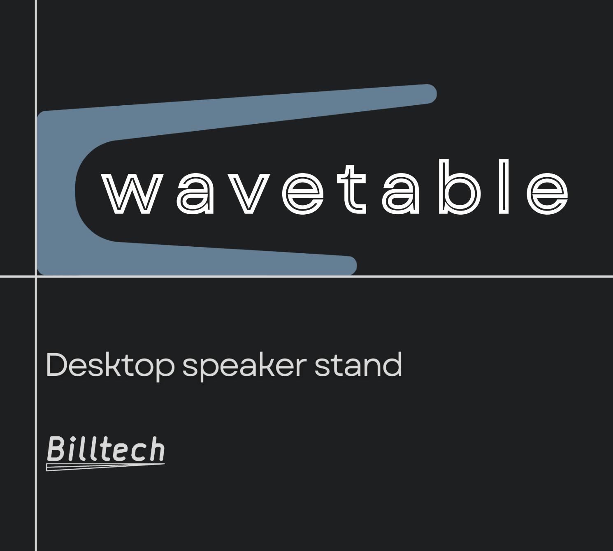
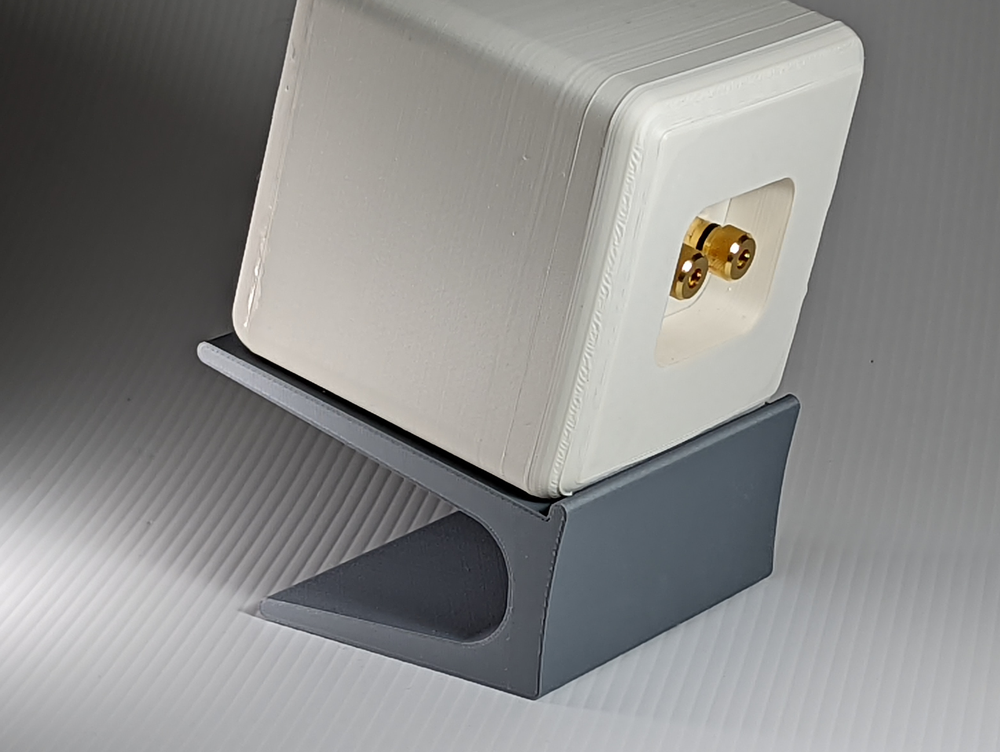
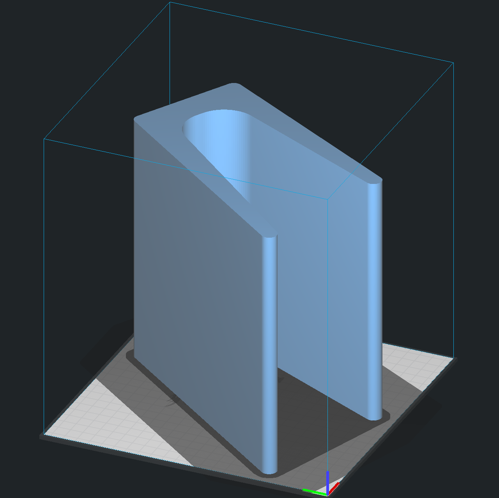

# Overview.

Wavetable is a customizable, 3D printed speaker stand for your desktop.

Adjustable for height, width, tilt angle and more. The cantilevered design allows you to partially reuse the negative space below your speaker. Despite the smooth curves and floating appearance, the stand is able hold the weight of large studio monitors easily.

Large or small, with or without a backstop, and highly configurable through the OpenSCAD parameters.

Here the large version is holding the Yamaha HS80 Studio Monitor, weighing in at 11.3 kg (\~25 lbs). Mounting putty (blue-tack or similar) is useful for keeping speakers in place without a backstop, as the surface is somewhat slick when using PLA. I sometimes use it for the stand base and on the speaker so everything stays put.

Pictured above is a prototype 3D printed speaker on the small stand with backstop.

# Modifications.

I am trying a new approach to modification with this model, through the use of the `params_<name>.scad` files.

Open up `wavetable_desktop_speaker_design.scad` in OpenSCAD and edit the import line to point to your desired params file. Open up the same params file in your text editor and take a look at the configurable parameters. Let the ASCII diagram guide you, let the comments fill in the rest.

A few preconfigured examples are provided that are similar to what is pictured here.

Saving will automatically update the main file showing your changes. This approach enables easy and flexible configuration like the OpenSCAD customizer, but has an advantage of easily saving multiple configurations. This opens the possibility of building a database for common speakers.

# Print Recommendations.

The `params_template_large.scad` results in a model the just barely fits on the platform of an Ender 3.

For all models it is recommended to use an orientation like above. Smaller models can be interwoven and printed two at once, although one at a time is preferred for best quality. The single profile makes for an easy print.

- Examples were printed in Overture Light Grey Matte PLA.
- Brim is advised to prevent warping of the thinner edges.
- 0.2mm layer height is good, 0.3mm layer height works well to reduce the print time especially for larger stands.
- 4 layers top and bottom for strength.
- 3 or 4 walls at 0.4 line width, for strength.
- 15 to 30% infill. Most patterns work well although I prefer cubic currently. Strength mostly comes from the walls and sides, not the infill.